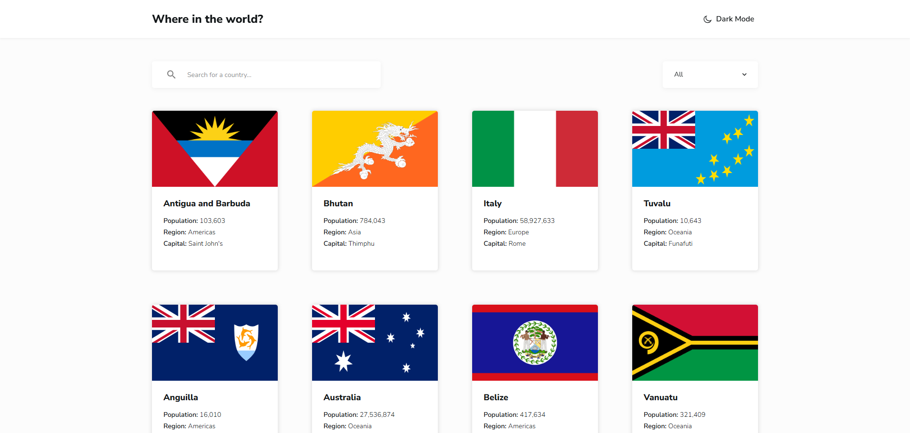
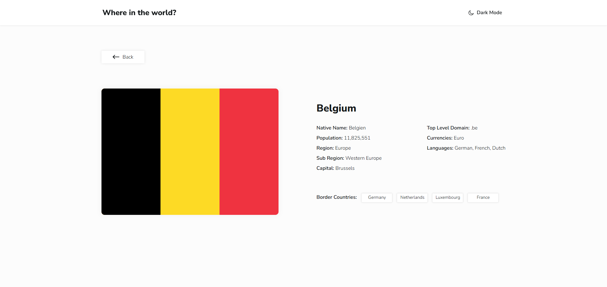

# REST Countries API with color theme switcher

[Live Demo](https://yileeya.github.io/react-countries/)





This project is a solution to the [REST Countries API with color theme switcher challenge on Frontend Mentor](https://www.frontendmentor.io/challenges/rest-countries-api-with-color-theme-switcher-5cacc469fec04111f7b848ca).  
It is a single-page application (SPA) built with React that fetches data from the REST Countries API.  
Users can search for countries, filter them by region, and toggle between light and dark mode.

---
## Features

- Display all countries on the homepage
- Search countries by name
- Filter countries by region
- View detailed information on a separate country page
- Navigate through border countries from the detail page
- Toggle between light and dark mode
- Sticky search bar so it remains visible when scrolling
- Fully responsive design for mobile and desktop

---

## Tech Stack

- **React 19 & TypeScript**: Utilizing the latest React features with strict type safety.
- **TanStack Query**: Handles server-state management, caching, and efficient data fetching.
- **Tailwind CSS V4**: Modern, high-performance utility-first styling.
- **React Router**: Manages client-side routing and dynamic URL parameters.
- **Axios**: Structured HTTP client for API requests.
- **React Loading Skeleton**: Provides elegant visual feedback during loading states.

---

## Key Highlights & Challenges

- **Performance Optimization**: Implemented **TanStack Query** to cache API responses, significantly reducing redundant network requests and improving navigation speed.
- **Polished UX**: Integrated **Skeleton Screens** to prevent layout shifts (CLS) and enhanced UI accessibility with a **Sticky Search Bar**.
- **Advanced State Management**: Used **Context API** combined with custom hooks to manage the global theme without prop-drilling.
- **Data Integrity**: Leveraged **TypeScript Interfaces** to map the complex REST Countries API schema, ensuring code reliability and preventing runtime errors.

---

## Installation / Setup
Make sure you have Node.js 20 or above installed.
1. Install dependencies:
```bash
   npm install
    # or
    yarn install
```
2. Start the development server:
```bash
   npm run dev
    # or
    yarn dev
```
3. Open [http://localhost:5173](http://localhost:5173) to view it in the browser.

---

## Project Structure

```
react-countries/
├─ public/       
├─ src/
│  ├─ api/        
│  ├─ assets/   
│  ├─ components/ 
│  ├─ contexts/   # Context Providers
│  ├─ hooks/     
│  ├─ pages/      
│  ├─ styles/     
│  ├─ types/ 
│  ├─ App.tsx 
│  ├─ index.css
│  └─ main.tsx
├─ .prettierrc.json
├─ eslint.config.js
├─ index.html
├─ package.json
├─ tsconfig.json
└─ vite.config.ts     
```
